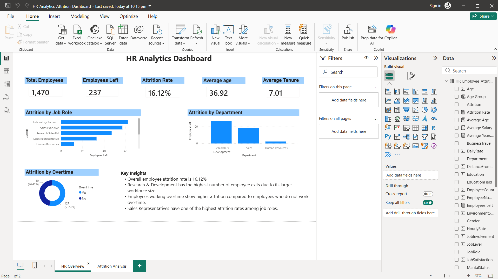
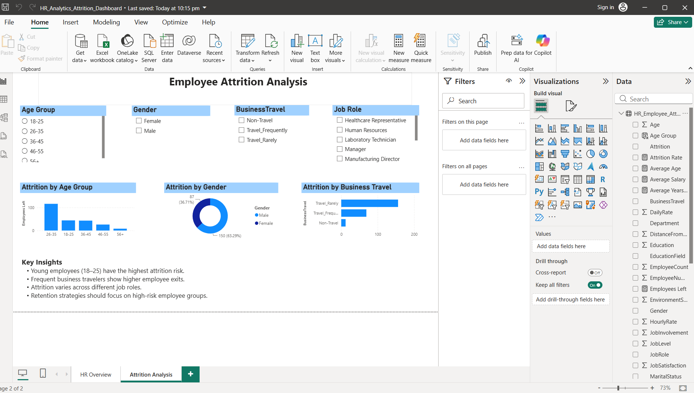

<div align="center">

# 📊 HR Analytics Employee Attrition Dashboard

### An Interactive HR Analytics Dashboard built using **Power BI, SQL, DAX, and Excel** to analyze employee attrition and support data-driven HR decisions.


</div>

⭐ An end-to-end HR Analytics project showcasing SQL analysis, DAX measures, and interactive Power BI dashboards to identify employee attrition trends.

---


# 📌 Project Overview

Employee attrition is a major challenge for organizations because it affects productivity, recruitment costs, and workforce stability.

This project analyzes employee attrition using an interactive Power BI dashboard. It enables HR teams to identify attrition patterns, understand the factors influencing employee turnover, and make informed decisions to improve employee retention.

---

# 🎯 Business Objective

The primary objectives of this project are to:

* Analyze employee attrition trends.
* Identify high-risk employee groups.
* Evaluate the impact of overtime, business travel, age, and job roles.
* Support HR teams with data-driven decision-making.
* Improve employee retention strategies.

---

# 🛠️ Tools & Technologies

| Tool     | Purpose                    |
| -------- | -------------------------- |
| Power BI | Dashboard Development      |
| SQL      | Data Analysis & Querying   |
| DAX      | KPI & Measure Calculations |
| Excel    | Data Preparation           |

---

# 📂 Dataset Information

The dataset contains employee information including:

* Employee ID
* Age
* Gender
* Department
* Job Role
* Business Travel
* Overtime
* Attrition
* Monthly Income
* Years at Company
* Job Satisfaction
* Education
* Performance Rating

---

# 📊 Dashboard Pages

## 📄 Page 1 – HR Overview Dashboard

This page provides a high-level summary of the organization's workforce.

### KPIs

* Total Employees
* Employees Left
* Attrition Rate

### Visualizations

* Department-wise Attrition
* Overtime Analysis
* Employee Distribution
* Interactive Slicers

---

## 📄 Page 2 – Employee Attrition Analysis

This page focuses on understanding which employee groups have higher attrition.

### Analysis Includes

* Attrition by Age Group
* Attrition by Gender
* Attrition by Business Travel
* Attrition by Job Role

---

# 📸 Dashboard Preview

## 🏠 Page 1 – HR Overview



---

## 📈 Page 2 – Employee Attrition Analysis



---

# 📈 Key Performance Indicators (KPIs)

* 👥 Total Employees
* 🚪 Employees Left
* 📉 Attrition Rate

---

# 💡 Key Insights

* Younger employees experience comparatively higher attrition.
* Employees working overtime have a greater likelihood of leaving.
* Business travel is one of the important factors influencing employee attrition.
* Certain job roles have higher employee turnover than others.
* Employee attrition varies across different demographic groups.

---

# 💼 Business Recommendations

* Improve work-life balance by reducing excessive overtime.
* Strengthen employee engagement programs for younger employees.
* Monitor departments and job roles with higher attrition.
* Review travel policies for employees with frequent business travel.
* Develop targeted retention strategies for high-risk employee groups.

---

# 🚀 Skills Demonstrated

* Data Cleaning
* SQL Query Writing
* Data Analysis
* KPI Development
* DAX Measures
* Interactive Dashboard Design
* Business Insight Generation
* HR Analytics
* Data Visualization
* Problem Solving

---

# 📁 Repository Structure

```text
HR-Analytics-Employee-Attrition/
│
├── Dataset/
│   └── HR_Employee_Attrition.csv
│
├── SQL/
│   └── HR_Analytics_SQL_Queries.sql
│
├── PowerBI/
│   └── HR_Analytics_Dashboard.pbix
│
├── Images/
│   ├── Dashboard_Page1.png
│   └── Dashboard_Page2.png
│
└── README.md
```

---

# 🔮 Future Enhancements

* Predict employee attrition using Machine Learning.
* Add salary and compensation analysis.
* Include performance trend analysis.
* Build drill-through reports for detailed employee insights.
* Create role-based dashboards for HR managers.

---

# 👩‍💻 Author

**Riya Saxena**

💼 Aspiring Data Analyst | Power BI • SQL • Excel • Python

🔗 GitHub: https://github.com/riyasaxena11

---

⭐ If you found this project helpful, consider giving this repository a **Star**!
